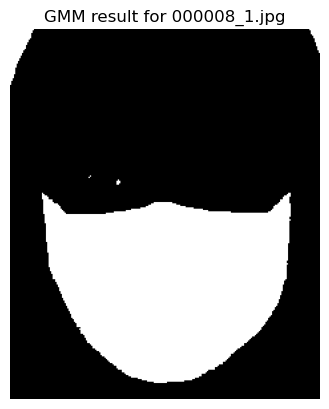
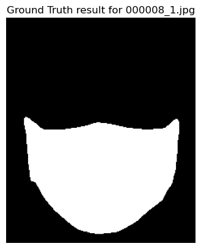
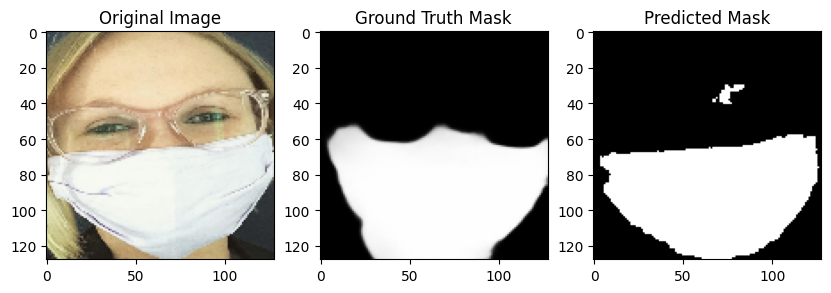

# VR Mini Project 1 : Project: Face Mask Detection, Classification, and Segmentation

## Index

- [Introduction](#introduction)
- [Dataset](#dataset)
- [Methodology](#methodology)
- [Experiments](#experiments)
- [Results](#results)
- [Observations and Challenges](#observations-and-challenges)
- [Steps to Run](#steps-to-run)
- [Contributions](#contributions)

---

## Introduction

The aim of this project was to perform facemask detection, classification and segmentation on a couple of facemask datasets. Specifically, the objectives were:
- Binary classification of images (with or without mask) using handcrafted features and traditional models, as well as using CNNs.
- Facemask segmentation and evaluation using traditional methods like GMMs, K-Means, Watershed etc. as well as using U-Net.

---

## Dataset

- The first dataset, used for classification tasks, contains around 2000 images each of faces with and without masks. All images have variations in size, illumination, gender, pose, etc.
- The second dataset, used for segmentation tasks, contains around 9000 images, again in various sizes and lighting conditions, of people wearing a face mask. For each image, the ground truth segmented output with the facemmask region coloured white, and the remaining region black is also provided.

---

## Methodology

### Classification Tasks

For the handcrafted features part, we did the following:

**Preprocessing**: Converted images to grayscale and resized to 64×64 pixels.

**Feature Extraction**: Applied Histogram of Oriented Gradients (HOG) to capture edge and texture information by computing gradient orientations in localized regions of the image, emphasizing shape and structure for effective classification.

**Models Used**: We used an SVM classifier with an RBF kernel, along with a Multilayer Perceptron with 100 hidden layers, ReLU activation, optimized using Adam.

For the CNN part, we did the following:

**CNN Architecture**: 2 convolutional layers with 32 and 64 filters respectively along with max pooling, followed by a dense layer with 128 filters and then a dropout layer. Other hyperparameters like learning rates, activations, epochs and batch sizes were tuned and selected.

### Segmentation

We tried the following traditional methods:

- K-Means: Performed K-Means clustering on pixel RGB values to segment the image into two clusters, aiming to distinguish mask and non-mask regions.
- GMM: Applied Gaussian Mixture Models for clustering, treating the image as a mixture of two distributions to separate the facemask region.
- Thresholding: Used Otsu’s method to determine an optimal threshold value for segmenting the facemask region from the background.
- Watershed: Utilized the Watershed algorithm combined with morphological operations to segment the image. This method may produce more than just mask and non-mask regions.
- Canny: Apply the Canny edge detector to identify edges, followed by two different approaches for segmentation:

   - Detect prominent horizontal and vertical edges, then fill regions between them to obtain the segmented mask.
   - Perform a breadth-first search (BFS) to identify large edges, then use the minimum and maximum x and y coordinates of these edges to approximate the mask’s location. If strong edges appear outside the mask region, segmentation accuracy may be affected.

---

For the U-Net part, we did the following:

**Preprocessing**: Converted images to grayscale and resized to 64×64 pixels.
**Architecture**: The model follows a standard U-Net architecture with an encoder and a decoder part, and skip connections for preserving spatial features.
 - The encoder block (downsampling) has 4 separable convolutional blocks with 32, 64, 128 and 512 filters respectively, with max pooling after each of the first 3 layers. The final convolution layer is the bottleneck layer, bridging the encoder and decoder while capturing high-level features
 - The decoder block upsamples the feature maps back to the size of the input using 3 transposed convolution layers with 128, 64 and 32 filters respectively, and restores details using skip connections. A final convolution layer with sigmoid activation + thresholding is used to produce a binary mask that segments the facemask region.

## Experiments

### Classification

All 3 models were thoroughly evaluated with a variety of hyperparameters like activations, kernels, number of epochs, optimizers, batch sizes, learning rates, number of filters etc. We also experimented with different architectures for the CNN, which involved varying the number of convolutional and fully connected layers.

### Segmentation

- K-Means, GMM, and Otsu thresholding were straightforward to code and required no specific experiments.
- Using the watershed algorithm involved tweaking the morphological operation (CLOSE OR OPEN), the threshold limits, and the size of the blurring kernel. However, no significant improvement was observed. If it performed better on one image, it didn't perform as well on another.
- Watershed cannot be scored using something like IoU as it is possible that more than two regions are obtained. Assigning these as mask and not mask needs manual intervention.
- Canny is an edge detector and not for segmentation. So, coming up with techniques to use this method to aid in segmentation was not a trivial task. Although the methods used here are not robust algorithms with formal proofs, they perform at a level comparable to the other methods.

- With the U-Net model, the experiments performed were tweaking hyperparameters like filter sizes and number of filters, different activations and loss functions. We also tried modifying the architecture by adding some batch norm and dropout layers, but they did not improve the model significantly. Also, we tried using SeparableConv2D instead of normal convolutions which applies depthwise and pointwise filtering, requiring fewer parameters without significant losses in accuracy, and Conv2DTranspose while upsampling, which allows reconstruction of high-resolution images.
- An interesting thing to note was that the model performed equally well on smaller image sizes (64×64) as it did on larger ones (96×96 and 128×128). This is because the object of interest (the facemask) is clearly distinguishable even in the smaller images, and downsampling in U-Net reduces resolution anyway. The mdoel performance also did not improve a lot when we augmented data using albumentations, suggesting that the original dataset is diverse enough.

---

## Results

### Classification

- SVM achieved an accuracy of around 93%, and the MLP got around 92%.
- The CNN model gave the highest accuracy of around 97%.
- SVM and MLP are better suited for smaller datasets because they rely on manually extracted features rather than learning them directly from raw data. This makes them effective when data is limited but restricts their ability to generalize to complex patterns.
- Unlike CNNs, SVM and MLP do not capture spatial hierarchies such as edges, textures, and shapes. CNNs leverage convolutional layers to automatically learn these features, making them more powerful for image-based tasks where spatial relationships are crucial.

### Segmentation

- All the traditional segmentation methods used are susceptible to errors due to variations in lighting conditions, contrast, colors, gradients, and mask designs across images. Otsu thresholding struggles with images taken under different conditions, often failing when there is no clear intensity separation. K-means and GMM can produce highly inaccurate results, especially when the background color closely resembles the mask, leading to poor cluster differentiation. Canny edge-based segmentation is purely heuristic and performs poorly when non-mask regions contain strong edges, causing false detections. Segmentation performance is evaluated using Intersection over Union (IoU) or Dice scores, with the highest IoU score of 0.93 achieved by GMM. However, in challenging cases such as blurred images, IoU scores as low as 0.2 were observed.
- Here are the average IOU scores across the first 100 images:

    - kmeans - 0.46
    - gmm - 0.51
    - canny1 - 0.52
    - canny2 - 0.55
    - otsu - 0.45

Here are the obtained and expected outputs for gmm on an image:




- In case of the U-Net, mean validation IoU and dice scores of around 75% and 85% were achieved, with the highest IoU being around 95% and the lowest being around 65%. This indicates that in general, U-Net performs much better than the traditional methods at facemask segmentation. Better results could have been obtained by using more data, running the model for longer (more epochs), or having more layers, but would have required more time and compute. The expected and obtained output for a random sample is given below.


---

## Observations and Challenges

- The CNN performs better than the SVM and the MLP in the classification task, but takes more time.
- For segmentation tasks, traditional methods give very good results on some samples but poor results on others. On average, the U-Net performs much better than traditional methods.

- The biggest challenges were training the CNN and the U-Net, since they required a lot of time and compute power to train on big datasets. Another challenge was the diversity in the facemask segmentation dataset, with various mask sizes, lighting conditions and other variables like hand on the mask, something written on the mask etc. These images were difficult to segment properly.

---

## Steps to Run

Add the datasets so that the directory structure looks as follows:

```none
📂classification
📂segmentation
📂datasets
 ┣ 📂dataset1
 ┃ ┣ 📂without_mask
 ┃ ┗ 📂with_mask
 ┣ 📂dataset2
 ┃ ┣ 📂face_crop
 ┗ ┗ 📂face_crop_segmentation
```

Ensure you have `python 3.10`. To install required libraries, run

```none
pip install -r requirements.txt
```

after which you can run the notebooks.

---

## Contributions

- IMT2022017 Prateek Rath : Wrote the code for Part C (Segmentation using traditional methods)
- IMT2022076 Mohit Naik : Wrote the code for Part D (Segmentation using U-Net)
- IMT2022519 Vedant Mangrulkar : Wrote the code for Parts A and B (Classification Tasks)

---

Github Link : https://github.com/mohit065/VR_Project1_MohitNaik_IMT2022076
